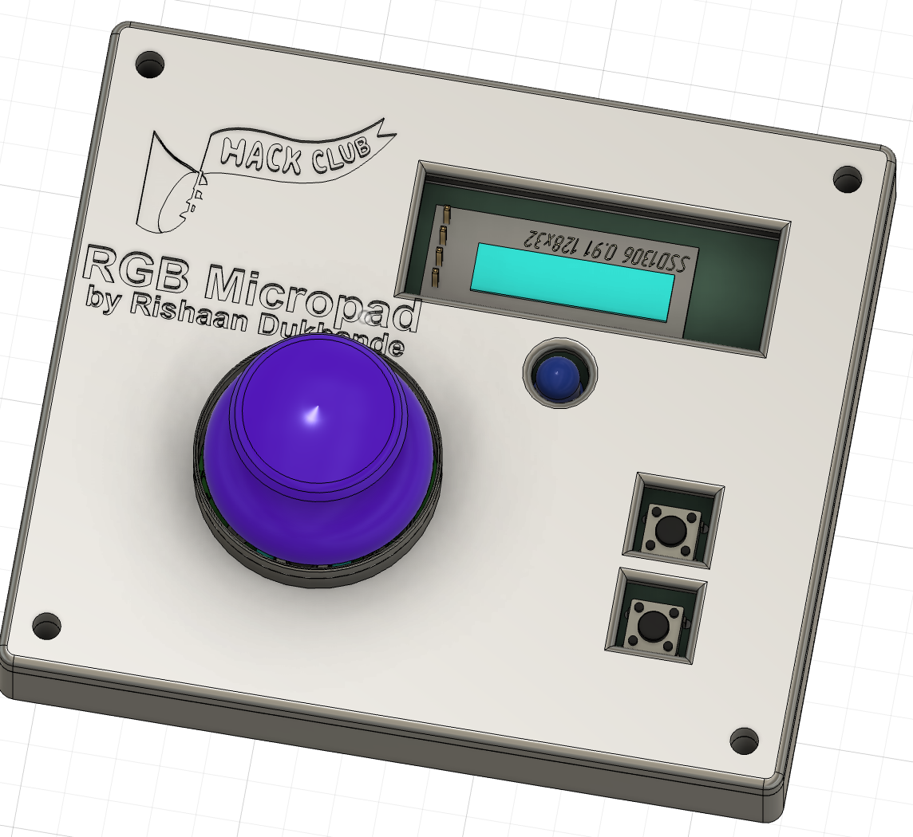
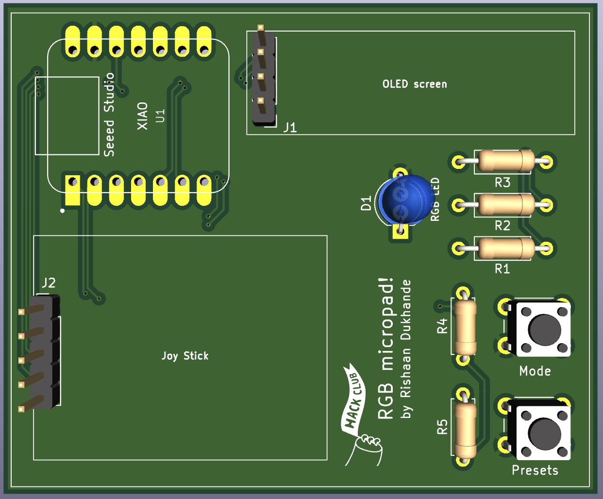
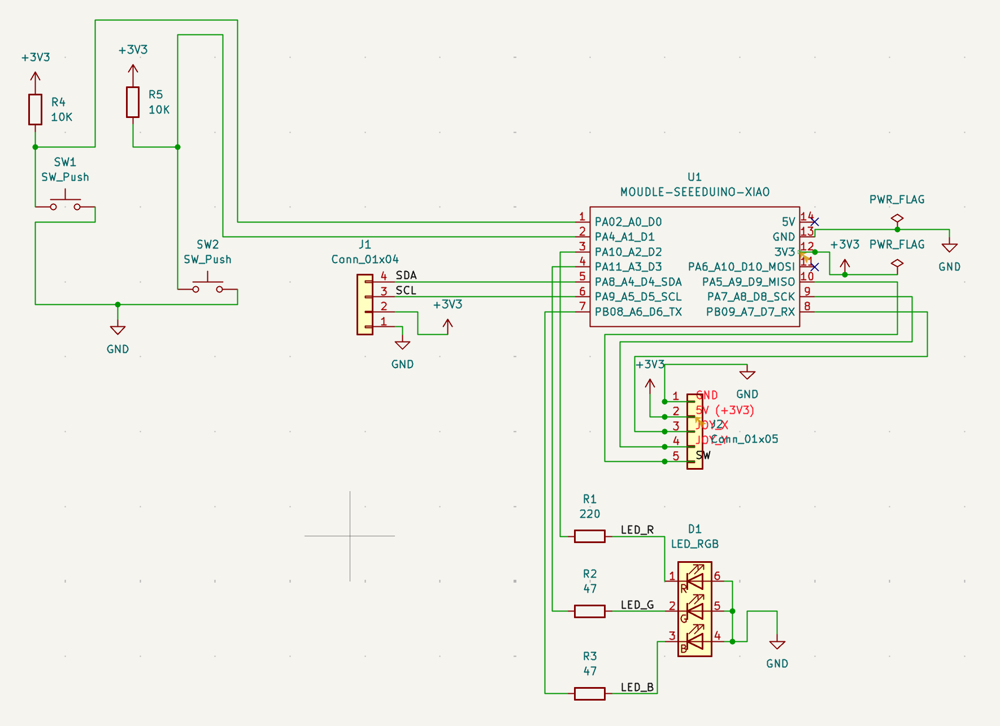
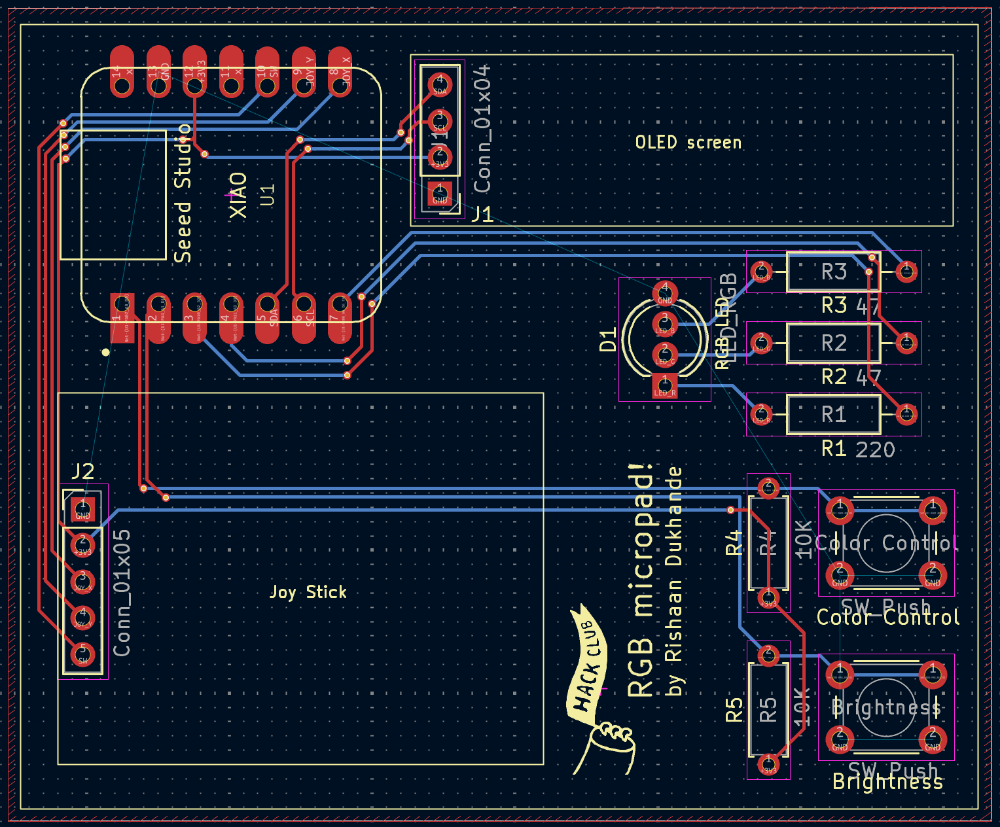
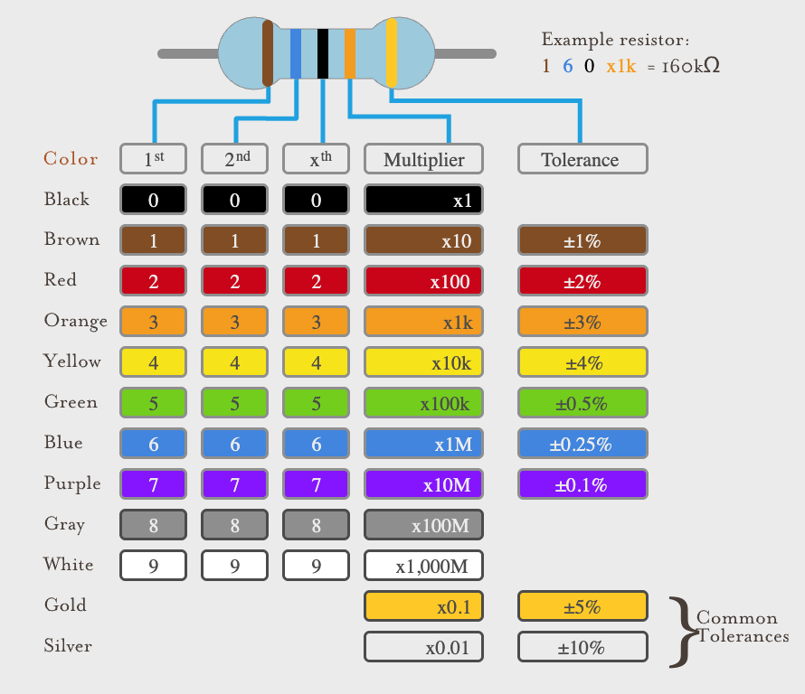

# Rishaan RGB micro hackpad

The RGB micro is a 2 key macropad with a joystick, an OLED Display, and one RGB LED - giving the user multiple ways to change an LED to any color and brightness they want! This serves as the first PCB I have created and is a great introductory project to develop PCB, CAD, and firmware skills for engineering! I created this project to develop these skills and enhance my engineering skills and knowledge. I have used RGBs and there is a color game called hues and cues, and this LED allows you to access a pallet just like the game, but in real life! Features, Images, and steps to recreate this project are listed below.

## Features:

* Portable 3D case with openings for components and USB connection
* Seeeduino XIAO SAMD21 controller
* 1 RGB LED for bright color display
* 2 tactile switch buttons for modes and presets
* Small OLED screen that displays the current RGB value in real time.
* Joystick for smooth & dynamic brightness and color control

## How it works

The RGB Micropad is a mini RGB LED controller. The joystick navigates 
a full 360° color wheel — pushing in any direction changes the LED to 
that hue in real time. SW1 toggles between Color mode and Brightness 
mode, while SW2 cycles through 8 color presets. Pressing the joystick 
button activates Saturation mode, letting the user dial between vivid 
and pastel tones and creating a larger array of colors for the LED to
display. The OLED screen shows the current mode, color name, 
RGB values, and brightness percentage at all times.

## PCB

Here's my PCB! Kicad was used to create both the schematic and layout of the pcb.

### Schematic

### PCB

The 1x4 connector on the top is for connecting the Oled Screen (SSD1306 0.91" OLED I2C 128x32) The 1x5 connector on the bottom center of the pcb is for connecting the controling joystick

## Sizes and PCB Info

* Board size: 56.95mm x 68.85mm
* 2 layer PCB
* Designed in KiCad 9.0

## Firmware
Written in CircuitPython. The main.py file enables the user to have the following controls:
* SW1 → Toggle between Color mode and Brightness mode
* SW2 → Cycle through 8 color presets
* Joystick button → Toggle saturation mode on/off
* Joystick X/Y → Navigate color wheel (Color mode) or adjust brightness (Brightness mode)
* OLED display → Shows current mode, color name, RGB values, and brightness %

## BOM:

Here is everything used in the RGB micro hackpad. Note that most of the prices come in sets because components cost the least when they are bought in bulk.

| **Qty** | **Component** | **Note** | **Price** |
|:--:|:--:|:--:|:--:|
| 1 | Seeeduino XIAO SAMD21 | Main processor | [~$5.40](https://www.seeedstudio.com/Seeeduino-XIAO-Arduino-Microcontroller-SAMD21-Cortex-M0+-p-4426.html) |
| 1 | SSD1306 0.91" OLED I2C 128x32 | Displays brightness and color info | [~$7.99](https://www.amazon.com/gp/product/B079BN2J8V/ref=ewc_pr_img_4?smid=A1WZRPJ0MN58A9&th=1) |
| 1 | Analog thumbstick joystick module KY-023 | Joystick control | [~$7.99](https://www.amazon.com/gp/product/B0GWQ6KXYP/ref=ewc_pr_img_3?smid=A3S807LE0L63AP&psc=1) |
| 1 | RGB LED 5mm common cathode | LED that is being controlled | [~$8.99 (100 pack)](https://www.amazon.com/gp/product/B01C3ZZT8W/ref=ewc_pr_img_1?smid=A14FP9XIRL6C1F&th=1) |
| 2 | 10KΩ resistor | Pull up resistors for buttons | [~$8.99 (kit)](https://www.amazon.com/Elegoo-Values-Resistor-Assortment-Compliant/dp/B072BL2VX1) |
| 1 | 220Ω resistor | Red LED pin | [included in resistor kit](https://www.amazon.com/Elegoo-Values-Resistor-Assortment-Compliant/dp/B072BL2VX1) |
| 2 | 47Ω resistor | Green and Blue LED pins | [included in resistor kit](https://www.amazon.com/Elegoo-Values-Resistor-Assortment-Compliant/dp/B072BL2VX1) |
| 2 | Tactile push button 6x6mm | Control modes for joystick control | [~$5.99 (pack)](https://www.amazon.com/gp/product/B07VSNN9S2/ref=ewc_pr_img_2?smid=AJJYA8M5YMCKV&psc=1) |
| 1 | 2.54mm pin header 1x04 | OLED screen connector | [~$6.99 (pack)](https://www.amazon.com/MCIGICM-Header-2-54mm-Arduino-Connector/dp/B07PKKY8BX) |
| 1 | 2.54mm pin header 1x05 | Joystick connector | [included in pack above](https://www.amazon.com/MCIGICM-Header-2-54mm-Arduino-Connector/dp/B07PKKY8BX) |

## Steps to Reproduce

### Parts
Order the parts in the Bill of Materials. These will be soldered on the PCB manually later on (unless specified in JLCPCB)

### PCB Manufacturing
1. Download PCB/gerbers.zip (in PCB folder of repository)
2. Upload to JLCPCB or PCBWay (You can get grants from hackclub if you edit the PCB before upload!)
3. Place the order - remember to pick the least expensive shipping!

### Assembly

1. Solder resistors R1-R5 onto the PCB. Utilize the following resistor values
2. Refer to the table above to read resistor values before incorporating them.
The table below has the resistor values with their placement on the PCB.

| **R#** | **Value** |
|:--:|:--:|
| R1 | 220Ω |
| R2 | 47Ω |
| R3 | 47Ω |
| R4 | 10KΩ |
| R5 | 10KΩ |
  
3. Solder RGB LED into the D1 slot on the PCB
4. Solder tactile switches SW1 and SW2.
5. Solder 5 pin header into the slot for the Joystick
6. Solder 4 pin header into the slot for the OLED screen
7. Solder XIAO SAMD21 on the top left of the board

### Firmware
1. Install CircuitPython on XIAO SAMD21
2. Copy Firmware/main.py to CIRCUITPY drive (in firmware folder of repo)
3. Copy required libraries to CIRCUITPY/lib/ to run the firmware on the PCB:
   a. adafruit_ssd1306
   b. adafruit_bus_device
   c. adafruit_framebuf

### Flashing Instructions (Make sure firmware is on PCB)
1. Download CircuitPython for XIAO SAMD21 from circuitpython.org
2. Double tap reset button on XIAO — drive called XIAO-BOOT appears
3. Drag CircuitPython .uf2 file onto XIAO-BOOT drive
4. Drive reappears as CIRCUITPY
5. Copy main.py to CIRCUITPY root
6. Copy libraries to CIRCUITPY/lib/
7. The board should run automatically when it is powered

### Verify your RGB Micropad works!
1. Plug in via USB (either computer of any electricity source)
2. OLED should show RGB Micropad splash screen
3. Move joystick to change LED color or brightness (depends on the mode you are on)
4. Press SW1 to toggle between modes!
   Mode 1: Color
   Mode 2: Brightness
5. Press SW2 to cycle through preset colors for LED
6. Press Joystick button to toggle saturation mode (This is an advanced mode for an additional array of colors)

## Devlog
### Session 1 — Schematic Design
The schematic was designed in Kicad. This included the following components:
1) XIAO SAMD21
2) RGB LED
3) Joystick module
4) OLED screen
5) Two tactile buttons

### Session 2 — PCB Layout
Note) This takes about 2 hrs for beginners
1) Layout of all components (If you are replicating, be creative and change locations of components).
2) Added GND copper pour so I don't have to route GND pins of every component
3) Routed the PCB connections between XIAO board and components
4) Created Silkscreen for aesthetics including Hack Club logo and component labels.

### Session 3 - Error with pullup resistors
1) Edited schematic by adding 10KΩ pullup resistors for both tactile switches
2) Used Ohm's law to calculate resistor values for RGB LED pins
   a) Blue and Green pins receive 47Ω resistors
   b) Red pin receives 220Ω resistors
   c) This occurs because they have different voltage requirements in order to power the color
3) Update PCB layout to include the resistors (2hrs).

### Session 4 — Firmware
1) Wrote CircuitPython firmware. This enables the PCB to have the following capabilities:
   a) Implemented color wheel for color mode control
   b) Brightness control from Joystick
   c) Mode navigation button to control both color and brightness with one Joystick
   d) Easily use joystick to change LED characteristics

### Session 5 — Case Design
Designed sandwich mount 3D-case in Fusion 360. The sandwich mount design can be found as the 5th mount in this [Different keyboard mounts](https://www.monsgeek.com/blog/comprehensive-guide-to-keyboard-mounting-styles/) document.

#### Bottom case (1hr)
1) Created bottom case with 0.4 mm clearance for PCB on all sides
2) Added 10mm thick walls all around board and 3.2mm diameter mounting holes
#### Top case (1 hr)
3) Measured placement of components on PCB and created openings
4) Added fillets to strengthen design and make it look good
5) Added project name, author, and hackclub svg logo

### Session 6 - README and Github Polish
1) Reviewed current github
2) Added devlog, images, and project info to the README.

## Extra stuff

I am ready to create more complex hackpads. Through this project, I was able to gain PCB making skills and refine my CAD skills. I am now confident that I can create electronic projects at a much faster pace with the use of these digital designing tools. If you have any project recommendations, please feel free to share them!
